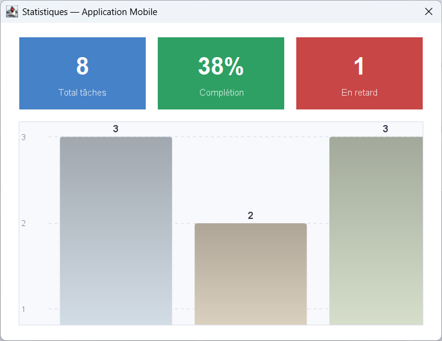
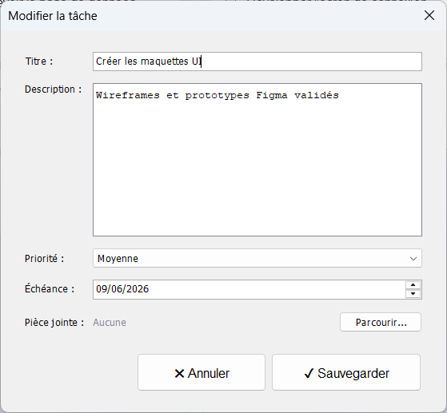

# ✅ TaskFlow — Application de Gestion de Tâches

TaskFlow est une application de bureau développée en **Java** avec **Eclipse IDE**, conçue pour organiser, suivre et gérer des tâches de manière simple et efficace. Les données sont persistées localement via des fichiers **JSON**.

---

## ✨ Fonctionnalités

### 📋 Gestion des Tâches
- Création de nouvelles tâches avec titre, description et priorité
- Modification et suppression de tâches existantes
- Marquage des tâches comme terminées

### 🗂️ Organisation
- Catégorisation des tâches par projet ou type
- Filtrage et tri des tâches (par priorité, statut, date)
- Vue d'ensemble de toutes les tâches en cours

### 💾 Persistance des données
- Sauvegarde automatique en JSON (via la bibliothèque Gson)
- Chargement des données au démarrage de l'application

### 🖼️ Interface graphique
- Interface desktop avec Java Swing / AWT
- Icônes personnalisées pour une meilleure expérience utilisateur

---

## 📸 Captures d'écran

### Vue principale
.png)

### Statistique


### Modification de tâche


---

## 🛠️ Technologies utilisées

| Technologie | Version / Détail |
|---|---|
| Java | JDK 8+ |
| Eclipse IDE | Java EE |
| Gson | 2.10.1 |
| Java Swing / AWT | Interface graphique |

---

## 🚀 Installation

1. Cloner le dépôt :
```bash
git clone https://github.com/Yazid0000/TaskFlow.git
```

2. Ouvrir **Eclipse IDE** → `File > Import > Existing Projects into Workspace`

3. Sélectionner le dossier cloné et cliquer sur **Finish**

4. Vérifier que `gson-2.10.1.jar` est bien dans le dossier `lib/`

5. Compiler et lancer via **Run > Run As > Java Application**

### Depuis la ligne de commande

```bash
# Compiler
javac -cp lib/gson-2.10.1.jar -d bin src/**/*.java

# Exécuter
java -cp bin:lib/gson-2.10.1.jar <MainClassName>
```

> Remplacer `<MainClassName>` par le nom de la classe principale du projet.

---

## 📁 Structure du projet

```
TaskFlow/
├── src/                    # Code source Java
├── bin/                    # Fichiers compilés (.class)
├── lib/
│   └── gson-2.10.1.jar     # Bibliothèque Gson (sérialisation JSON)
├── data/                   # Fichiers de données JSON
├── resources/
│   └── icons/              # Icônes de l'interface
├── .classpath              # Configuration classpath Eclipse
├── .project                # Fichier projet Eclipse
└── .settings/              # Paramètres Eclipse
```

---

## 👨‍💻 Auteur

**Yazid Bennouna**  
Étudiant en informatique  
[@Yazid0000](https://github.com/Yazid0000)

---

## 📄 Licence

Ce projet est développé dans le cadre d'un projet académique.
